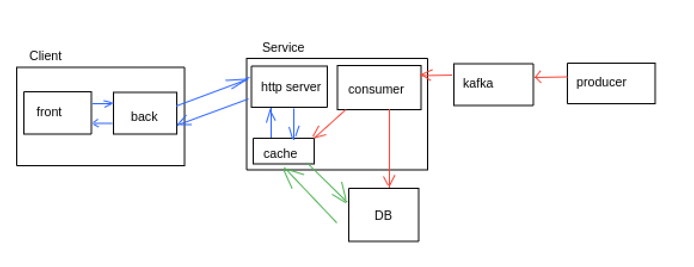

# Задание L0: Демонстрационный сервис

## Архитектура сервиса


## Запуск сервисов
1) Создать и заполнить файл .env, согласно файлу env-example
2) Из папки L0:
   - поднимаем postgres и kafka:
    ```
        docker compose up -d
    ```
   - из папки producer для запуска приложения producer:
    ```
        go run cmd/main.go
    ```
   - из папки service для запуска приложения service:
    ```
        go run cmd/main.go
    ```
   - из папки client для запуска приложения client:
    ```
        go run cmd/main.go
    ```
3) Для отправки сгенерированного сообщения в сервис, нужно в терминале приложения producer ввести "send"
